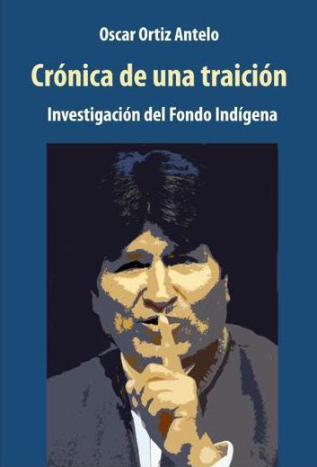

<meta charset="UTF-8">
<meta name="viewport" content="width=device-width, initial-scale=1, maximum-scale=1">
```{r setup, include=FALSE}
knitr::opts_chunk$set(echo = TRUE)
setwd("C:/Users/EMILIO JUSTINIANO/Desktop/Ortiz/INVESFOND")
#Carga de paquetes necesarios
pkgs <- c("rio", "magrittr", "xlsx", "readxl", "stringi", "gdata",
          "gsubfn", "dplyr", "plyr", "leaflet", "plotly", "knitr","rgdal")
lapply(pkgs, function(x) require(x, character.only = TRUE))
rm(pkgs)
```

<!-- Header -->
<center>
###**INVESTIGACIÓN DEL FONDO INDÍGENA:**
</center>
<center>
<h1>***CRÓNICA DE UNA TRAICIÓN***</h1>
</center>
<br>
<center><h4>(...) *Los pueblos indígenas hemos aprendido a convivir con la madre tierra y* ***somos la reserva moral de la humanidad*** (...)</h4></center>
<center><h4>**-Evo Morales Ayma, **"Conferencia Mundial sobre los Pueblos Indígenas"  (New York, 2014)</center></h4> 
<br>
<center></center>
<br>
<center>
#####**El MAS reivindicó lo indígena como parte central de su discurso electoral desde 2002 hasta la victoria que obtuvo en 2005.** Ya en función de gobierno, el MAS promovió la inclusión de una serie de derechos para los pueblos indígenas en la nueva Constitución Política del Estado y otras normas.

#####A pesar de ello, diversos hechos, **como el caso del TIPNIS**, muestran que **lo indígena no fue más que un recurso discursivo** que no influyó realmente en el desarrollo planificado y razonado de políticas de Estado.

#####Más aún, con frecuencia, **las organizaciones indígenas fueron instrumentalizadas mediante una estrategia política** que significó la **otorgación de beneficios económicos** a aquellas (mayormente sindicales y no indígenas) que, a pesar de malos manejos de los recursos, mantuvieron **fidelidad incondicional al gobierno**, mientras que aquellas que criticaron las decisiones gubernamentales se vieron fuertemente afectadas.
</center>
<br>
<center><h3>**La Investigación del Fondo Indígena: Crónica de una Traición **</h3></center>
<br>

<h5>Analiza con profundidad los hechos, los implicados y las cifras, que deja la utilización de los recursos del Fondo Indígena **desde 2005 hasta 2015,** con base en datos oficiales y otros que son resultado de una exahustiva investigación.</h5>
<br>
<center><h4>**Muestra con claridad:**</h4></center>
<br>
<h5>
- El uso de los recursos como favor político con miras electorales,

- El castigo a organizaciones indígenas que tomaron distancia,

- La discrecionalidad en el manejo de los recursos,

- La violación sistemática de las normas,

- Las y los implicados que la población boliviana merece conocer, analizar y opinar.
</h5>
<br>
<center><h2>**El Contexto Económico y SocioPolítico**</h2></center>
<br>
<center><h4>Fig. 1: Ingresos y Egresos en el Fondo Indígena - Gestiones 2005 a 2015  </center></h4>
<center>
```{r, echo=FALSE, include= TRUE, fig.align='center',fig.width = 1, fig.height = 3}
f0<- rio::import("Transferencias por Gestiones .xlsx")
#Convertir Gestiones a Factor, para la visualización
f0$Gestiones<- as.factor(f0$Gestiones)
plot_ly(f0, x = f0$`Ingresos `, y =f0$Gestiones , type = 'bar', 
        orientation = 'h',
        name = 'Ingresos en Bs.',
        text = ~paste('Ingreso de',f0$`Ingresos Bs.`,'Bs.'),
        hoverinfo = 'text',
        width =300, height = 400,
        marker = list(color = 'rgba(11, 170, 157, 0.8 )',
                      line = list(color = 'rgba(11, 170, 157, 0.8 )',
                                  width = 3))) %>%
  add_trace(x = f0$`Egresos Bs.`, name = 'Egresos en Bs.',
            text = ~paste('Egreso de',f0$`Egresos `,'Bs.'),
        hoverinfo = 'text',
            marker = list(color = 'rgba(0, 108, 110, 0.8 )',
                          line = list(color = 'rgba(0, 108, 110, 0.8 )',
                                      width = 3))) %>%
  layout(barmode = 'stack',
         hovermode = 'closest',
         xaxis = list(title = ""),
         yaxis = list(title = '',
                      showgrid =F ,
                      zeroline =F,
                      showticklabels = TRUE)
         )%>% hide_legend()

```
</center>
<center>Pulsa en las barras</center>
</center>
<center><h5>**El Fondo Indígena es creado en 2005 a partir de la distribución de recursos del Impuesto Directo a los Hidrocarburos (IDH)**, sin embargo, **es recién desde 2010 que estos recursos comienzan a ser distribuidos para financiar proyectos.** Varios decretos ponen en funcionamiento el mecanismo, con el fin de financiar proyectos de carácter productivo y social. Pero... </h5>
<br>
<center><h3>**¿Por qué recién después de 5 años se pone en funcionamiento el Fondo Indígena?**</h3></center>
<br>
<center><h4>**Los datos de la Figura 1 muestran que:**</h4></center>
<br>
<h5>
-  Durante el periodo 2005-2010, la estrategia política estaba financiada con recursos venezolanos canalizados a través del programa Bolivia Cambia - Evo Cumple.

-  El deterioro de la economía venezolana y la muerte del ex Presidente Hugo Chávez produjeron un descenso en las transferencias venezolanas al programa Bolivia Cambia - Evo Cumple.

- A la par de este descenso, a partir de 2010, se advierte un incremento sostenido de la transferencias de recursos del Fondo Indígena, como se advierte en la Figura 1.</h5>
<br>
<center><h5>**Si bien el Programa Bolivia Cambia Evo Cumple financiaba proyectos con la mediación de autoridades municipales, el Fondo Indígena acudía directamente a las organizaciones indígenas y campesinas.** <h/5></center>
<br>
<center><h1>**La Instrumentalización de lo Indígena**</h1></center>
<br>  
<center><h5>La utilización de lo indígena con fines electorales puede rastrearse por diferentes vías, sin embargo, la del Fondo Indígena puede ser una de las más reveladoras, pues **sobre la base de unos objetivos dignos y coherentes que pocos podrían criticar, se gesta una instrumentalización de los movimientos indígenas a gran escala.** En este estudio, partimos de la siguiente hipótesis:<h/5>

<h4>***El Fondo Indígena ha sido utilizado como parte de una estrategia político electoral del MAS para crear y sostener aliados, pero también para mostrar que aquellos que quieran restar su apoyo serán castigados.***</h4>

<h5>Por medio de varios datos, se podrá entender el carácter de esta estrategia y de las transgresiones legales que existieron.</h5></center>
<br>
<center><h4>Fig. 2: Mapa de Proyectos por Departamento</h4></center>

<center>
```{r, echo=FALSE, include= TRUE, fig.width = 3, fig.height = 4, message = F,}
# cargar el mapa
mapaf <- readOGR(dsn = "Departamental.dbf",
                layer = "Departamental", verbose = FALSE)

#cargar los pop ups
mapa_popup <- paste0("<strong>DEPARTAMENTO: </strong>", mapaf$NOM_DEP, "<br>", 
                     "<strong>Proyectos: </strong>", mapaf$departam_3, "<br>",
                     "<strong>Desembolsos Totales: </strong>", mapaf$departam_1,"<br>",
                     "<strong>Desembolsos Parciales: </strong>", mapaf$departam_2,"<br>",
                     "<strong>Bs Desembolsados: </strong>", mapaf$departam_5,"<br>",
                     "<strong>Costo Total en Bs:</strong>", mapaf$departam_4,"<br>",
                     "<strong>Saldo sin Ejecutar en Bs:</strong>", mapaf$departam_6)

# Visualizar el mapa                    
mapaf1 <- leaflet(mapaf) %>% 
  addPolygons(color = "black", weight = 0.6, smoothFactor = 0.5,
              opacity = 9.0, fillOpacity = 3, 
              
              popup = mapa_popup, 
              fillColor = ~colorFactor(c("#c6ecd9","#006C6E","#0BAA9D"),   departam_7)(departam_7)) 

mapaf1
```
<center><h7>Pulsar en los departamentos</h7></center>
</center>
<br>
<center><h5>A nivel departamental, los desembolsos de **recursos se concentran significativamente en el departamento de La Paz, donde se entregó más de 350 millones de bolivianos**, seguido  a una distancia considerable por **Beni, con casi 70 millones de bolivianos** y **Cochabamba con una cifra cercana a los 52 millones.** En el resto de los casos, las cifras de desembolso son menores a los 50 millones de bolivianos. La disparidad entonces es muy marcada, por ejemplo **Chuquisaca recibe 18 veces menos recursos por proyectos que La Paz.**
</h5></center> 

<br>

  <center><h2>**Las trillizas incondicionales**</h2></center>
<br>
  <center><h4>Fig. 3: Desembolsos, Costos y Proyectos por Organizaciones Sociales</h4></center>
<center><h4>Porcentaje de participación por Organización:
Desembolso Total </h4> 
</center>
```{r, echo=FALSE, include= TRUE, fig.width = 3, fig.height = 4, message = F,warning = F}
#Organizaciones Sociales

#Establecimiento del código para las trillizas
f3<-import("organizacion.csv")#Importando datos
colors1 <- c('rgba(11, 170, 157, 0.8 )',#Asignación de colores
             'rgba(11, 170, 157, 0.8 )',
             'rgba(11, 170, 157, 0.8 )',
             'rgb(211,94,96)', 'rgb(128,133,133)',
             'rgb(144,103,167)', 
             'rgb(171,104,87)', 'rgb(114,147,203)',
             'rgba(0, 108, 110, 0.8 )')
#Primer Torta, Organización por Desembolso
p1 <- plot_ly(f3, labels = f3$`Organizaci—n Social`,
             values = f3$`Total desembolsado`,
             type = 'pie',
             textposition = 'inside',
             textinfo = 'label+percent',
             text = ~paste(f3$deseti,'Bs.'
                           ),
             insidetextfont = list(color = '#FFFFFF'),
             hoverinfo = 'text',
             marker = list(colors = colors1,
                           line = list(color = '#FFFFFF', width = 1)) ) %>%
        layout(title = '',
               hovermode = 'closest',showlegend = FALSE,
               xaxis = list(showgrid = FALSE, zeroline = FALSE, showticklabels = FALSE),
               yaxis = list(showgrid = FALSE, zeroline = FALSE, showticklabels = FALSE))
p1#Imprimir Gráfico
```
<center><h4>Porcentaje de participación por Organización:
Cantidad de Proyectos</h4></center>
```{r, echo=FALSE, include= TRUE, fig.width = 3, fig.height = 4, message = F,warning = F}
#Segunda Torta
p2 <- plot_ly(f3, labels = f3$`Organizaci—n Social`,
              values = f3$`Proyectos aprobados`,
              type = 'pie',
              textposition = 'inside',
              textinfo = 'label+percent',
              text = ~paste(f3$`Proyectos aprobados`,'Proyectos'),
              insidetextfont = list(color = '#FFFFFF'),
              hoverinfo = 'text',
              marker = list(colors = colors1,
                            line = list(color = '#FFFFFF', width = 1)) ) %>%
        layout(title = '',
               hovermode = 'closest',showlegend = FALSE,
               xaxis = list(showgrid = FALSE, zeroline = FALSE, showticklabels = FALSE),
               yaxis = list(showgrid = FALSE, zeroline = FALSE, showticklabels = FALSE))
p2#imprimir segundo gráfico
```
<center><h4>Porcentaje de participación por Organización:
Costos de Proyectos</h4></center>
```{r, echo=FALSE, include= TRUE, fig.width = 3, fig.height = 4, message = F,warning = F}
#Tercer torta
p3 <- plot_ly(f3, labels = f3$`Organizaci—n Social`,
              values = f3$`Costo del Proyecto segœn Convenio`,
              type = 'pie',
              textposition = 'inside',
              textinfo = 'label+percent',
              text =~paste(f3$costoeti,
                           'Bs.'),
              insidetextfont = list(color = '#FFFFFF'),
              hoverinfo = 'text',
              marker = list(colors = colors1,
                            line = list(color = '#FFFFFF', width = 1)) ) %>%
        layout(title = '',
               hovermode = 'closest',showlegend = FALSE,
               xaxis = list(showgrid = FALSE, zeroline = FALSE, showticklabels = FALSE),
               yaxis = list(showgrid = FALSE, zeroline = FALSE, showticklabels = FALSE))
p3

```
<center> Pulsa en los gráficos</center> 
</center> 
<center><h5>En relación a las organizaciones beneficiarias, **destacan las CSUTCB y la CSCIB que juntas reciben más de 400 millones de bolivianos,** a diferencia de **CONAMAQ y CIDOB, las cuales tuvieron diferencias sustanciales con el gobierno y por lo que, ambas, recibieron más de 150 millones de bolivianos** La grandes brechas existentes, precisamente pueden explicarse a periodos y procesos de distanciamiento con el Gobierno de Evo Morales. La correlación entre la reducción de montos desembolsados y el distanciamiento se explicará con detalle en otra sección.
</h5>
</center>
<br>
<center><h2>**Juez y Parte: El resultado de una mala gestión basada en el favor político**</h2></center>
<br>
<center><h4> Fig. 4: Estado de los 1100 Proyectos </h4></center>
<br><center>
<h4>Proporción de proyectos según su estado</h4>
```{r, echo=FALSE, include= TRUE, fig.width = 3, fig.height = 4, message = F, warning=F}
f4<- import("Estado de los Proyectos .xlsx")
names(f4)<- c("Clasificacion","Proyectos","Porcentaje","Importe Transferido Bs.", "etitrans")
colors2 <- c('rgb(211,94,96)', 'rgb(128,133,133)', 'rgb(144,103,167)', 
             'rgb(171,104,87)', 'rgb(114,147,203)','rgba(0, 108, 110, 0.8 )')
#Primer Torta, Organización por Desembolso
p_1 <- plot_ly(f4, labels = f4$Clasificacion,
             values = f4$Proyectos,
             type = 'pie',
             textposition = 'inside',
             textinfo = 'label+percent',
             text = ~paste(f4$Proyectos,'Proyectos'),
             insidetextfont = list(color = '#FFFFFF'),
             hoverinfo = 'text',
             marker = list(colors = colors2,
                           line = list(color = '#FFFFFF', width = 1)) ) %>%
        layout(title = '',
               hovermode = 'closest',showlegend = FALSE,
               xaxis = list(showgrid = FALSE, zeroline = FALSE, showticklabels = FALSE),
               yaxis = list(showgrid = FALSE, zeroline = FALSE, showticklabels = FALSE))
p_1#Imprimir Gráfico
```
<h4>Proporción de desembolsos según su estado</h4>
```{r, echo=FALSE, include= TRUE, fig.width = 3, fig.height = 4, message = F, warning=F}
#Segunda Torta
p_2 <- plot_ly(f4, labels = f4$Clasificacion,
              values = f4$`Importe Transferido Bs.`,
              type = 'pie',
              textposition = 'inside',
              textinfo = 'label+percent',
              text = ~paste(f4$etitrans,'Bs.'),
              insidetextfont = list(color = '#FFFFFF'),
              hoverinfo = 'text',
              marker = list(colors = colors2,
                            line = list(color = '#FFFFFF', width = 1)) ) %>%
        layout(title = '',
               hovermode = 'closest',showlegend = FALSE,
               xaxis = list(showgrid = FALSE, zeroline = FALSE, showticklabels = FALSE),
               yaxis = list(showgrid = FALSE, zeroline = FALSE, showticklabels = FALSE))
p_2

```
</center>
<center> Pulsa en los gráficos</center> 
<center>
<h5>Como puede observarse, hay un gran número de proyectos que de acuerdo al informe de la interventora, **NO EXISTEN**, están denunciados o tienen observaciones.
Este dato muestra con claridad la mala gestión de los proyectos y las obvias deficiencias de un modelo que no tiene mecanismos de control.
Del recuento de proyectos según su estado, **destaca una gran cantidad de proyectos denunciados por la Contraloría General del Estado ante la Fiscalía, cifra que alcanza más de 160.** Por otra parte, **la cantidad de proyectos inexistentes alcanza más de una veintena. **
</h5></center>
<center>

</center>
<br>
<br>
<center><h2>**Los Momentos Clave** </h2></center>
<br>
<center><h4> Fig. 5: Línea de tiempo de transferencias desde el Fondo Indígena </h4></center>
<div class="infogram-embed" data-id="ssss-802874827606" data-type="interactive" data-title="SSSS"></div><script>!function(e,t,s,i){var n="InfogramEmbeds",o=e.getElementsByTagName("script"),r=o[0],d=/^http:/.test(e.location)?"http:":"https:";if(/^\/{2}/.test(i)&&(i=d+i),window[n]&&window[n].initialized)window[n].process&&window[n].process();else if(!e.getElementById(s)){var a=e.createElement("script");a.async=1,a.id=s,a.src=i,r.parentNode.insertBefore(a,r)}}(document,"script","infogram-async","//e.infogr.am/js/dist/embed-loader-min.js");</script><div style="padding:8px 0;font-family:Arial!important;font-size:13px!important;line-height:15px!important;text-align:center;border-top:1px solid #dadada;margin:0 30px"><a href="https://infogr.am/ssss-802874827606" style="color:#989898!important;text-decoration:none!important;" target="_blank" rel="nofollow">SSSS</a><br><a href="https://infogr.am/create/line-chart?utm_source=embed_bottom&utm_medium=seo&utm_campaign=line_chart" style="color:#989898!important;text-decoration:none!important;" target="_blank" rel="nofollow">Create line charts</a></div>
<br>
<center><h5>En el tiempo, la cantidad de recursos desembolsados fue incrementando. **Entre 2011 y 2012 los proyectos alcanzaban poco más de 1 millón de bolivianos, con algunas excepciones**. A partir de 2013 la cantidad de proyectos con montos que superan el millón de bolivianos crece sustancialmente, **alcanzando en 2015 cifras cercanas a los 9 millones.** </h5</center>

<center>
<br>
<h5>**Los proyectos tenían programados hasta 4 desembolsos.** Como puede observarse, la gran mayoría llegó solamente al primero. Este dato es sintomático de una mala planificación y/o gestión de los proyectos. 
También es preocupante notar que hay momentos en los que se incrementan dramáticamente los desembolsos y que parecieran coincidir con la coyuntura política. Por ejemplo, **hay un pico en diciembre de 2011, justo después del conflicto del TIPNIS y en plena coyuntura de elecciones judiciales, para las que el gobierno central hizo una intensa campaña.**
</h5>

</center
<center>
<br>
<center><h2> **El Financiamiento Político ** </h2></center>
<br>
<center><h4> Fig. 6: Línea de tiempo de transferencias por organizaciones sociales </h4></center>

<div class="infogram-embed" data-id="sd-34660637478888" data-type="interactive" data-title="SD"></div><script>!function(e,t,s,i){var n="InfogramEmbeds",o=e.getElementsByTagName("script"),r=o[0],d=/^http:/.test(e.location)?"http:":"https:";if(/^\/{2}/.test(i)&&(i=d+i),window[n]&&window[n].initialized)window[n].process&&window[n].process();else if(!e.getElementById(s)){var a=e.createElement("script");a.async=1,a.id=s,a.src=i,r.parentNode.insertBefore(a,r)}}(document,"script","infogram-async","//e.infogr.am/js/dist/embed-loader-min.js");</script><div style="padding:8px 0;font-family:Arial!important;font-size:13px!important;line-height:15px!important;text-align:center;border-top:1px solid #dadada;margin:0 30px"><a href="https://infogr.am/sd-34660637478888" style="color:#989898!important;text-decoration:none!important;" target="_blank" rel="nofollow">SD</a><br><a href="https://infogr.am/create/line-chart?utm_source=embed_bottom&utm_medium=seo&utm_campaign=line_chart" style="color:#989898!important;text-decoration:none!important;" target="_blank" rel="nofollow">Create line charts</a></div>
<br>
</center>
<center>
<h5>Observando los montos desembolsados a las 8 organizaciones beneficiarias, se hace evidente que hay algunas que de manera desproporcionada obtienen recursos sobre otras.
Las organizaciones que mayores proyectos y recursos recibieron, coinciden con las alianzas políticas del gobierno central. 
**Si por ejemplo se observa el caso de CONAMAQ, el patrón de desembolsos coincide con los momentos de acercamiento o distanciamiento con el gobierno (Fig. 6). **
</h5>
</center>
<br>
<center><h2> **Los “beneficiarios” más importantes del FONDIOC**</h2></center>
<br>
<center><h4> Fig. 7: Titulares de cuenta que recibieron más de 3 millones de Bs. </h4></center>

<center>
```{r, echo=FALSE , fig.width = 2, fig.height = 6}
f5<-rio::import("Masde3millones .xlsx")
nf5 <-as.character(c("Soto R. Evarista",
                     "Rivero M. Hubert",
                     "Ramos S. Julia D.",
                     "Hurtado A. Melva",
                     "Choque S. Jorge",
                     "Justiniano G. Victoria",
                    "Florez L. Dionisio",
                    "Jiménez L. René", 
                    "Ali G. Rolando",
                    "Saloma A. Joaquín",
                    "Zuñiga O. Celia"))
f5<-  f5[1:11,]
f5<- data.frame(f5,nf5)
f5_1<-plot_ly(x= f5$Transferido,y =f5$nf5,
        type = 'bar',
        orientation = 'h',
        text = ~paste(f5$nf5,',',f5$T..Transferido,'Bs'),
        hoverinfo = 'text',
        name ='Bs./Titular de Cta.',
        marker = list(color = 'rgba(11, 170, 157, 0.8 )'),
        width =300, height = 400)%>%
  layout(title="",
         hovermode = 'closest',
         yaxis = list(title = 'Titulares de cuenta',
                      showgrid =F ,
                      zeroline =F,
                      showticklabels = FALSE))%>%hide_legend()
f5_1
```
<center>Pulsar en las Barras</center>
<br>
</center>
<center><h5>Aunque una gran mayoría de desembolsos se transfirieron de manera ilegal a cuentas bancarias personales, **destacan los casos de 11 personas que recibieron aproximadamente el 10% del dinero desembolsado de los 1100 proyectos**, incluyendo a **Rivero Méndez Hubert** que recibió la insólita cantidad de **11 millones en UNA SOLA TRANSFERENCIA.**</h5></center>
<br>
<center><h2> **Comunidades Beneficiarias** </h2></center>
<br>
<center><h4>  Mapa de Ubicación de los Proyectos del Fondo Indígena </h4></center>

<br>
<center><h5>Con la ayuda de la tecnología, hemos elaborado un mapa que contiene **la ubicación de todas las comunidades beneficiarias del Fondo Indígena** durante el periodo analizado en la investigación; donde se incluyeron los **datos de los proyectos, montos, ejecutores, responsables y beneficiarios directos.**
Es importante transparentar la información y que las y los ciudadanos de cualquier comunidad **puedan conocer, verificar y exigir resultados de las inversiones realizadas por el Fondo Indígena** en sus comunidades. **El verdadero control social es la transparentación de la información,** la población puede juzgar por sí misma si lo ocurrido en sus comunidades fue, de verdad, un programa de apoyo que reinvindique a los pueblos indígenas. Puedes buscar tu comunidad o la comunidad que conozcas en el siguiente enlace:</h5> </center>

<br>
<center>haz click aquí</center>
<center><h2><a href="https://www.google.com/maps/d/viewer?mid=1m-e2VIsgcSqfWq5YDXqe5Gwzzsc&ll=-16.92225267706156%2C-63.59099500000002&z=6">**BUSCA TU COMUNIDAD**</a></h2></center>

<br>
<br>
<br>
<br>